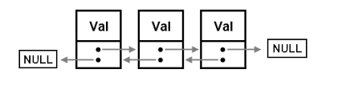

## Liste Doublement Chainée (LDC)

### Table of contents :
- [newList](#NewList)
- [isEmpty](#IsEmpty)
- [length](#Length)
- [firstNode](#FirstNode)
- [lastNode](#lastNode)
- [show](#show)
- [addFront](#addFront)
- [addBack](#addBack)
- [addAt](#addAt)
- [removeFront](#removeFront)
- [removeBack](#removeBack)
- [removeAt](#removeAt)
- [clear](#clear)

### newList
    Grenerate a new list of NULL value

### isEmpty
    Check if the value of the is list is NULL return True else False

### length
    return the length of the list(the number of nodes)

### firstNode
    return an integer value whitch is the value of the first node

### lastNode
    return an integer value whitch is the value of the last node  

### show
    show the list like show the value of each element of the list

### addFront
    add a new node to the front of the list

### addBack
    add a new node at the end of the list

### addAt
    add a new node at a specific position

### removeFront
    remove the first value of the list

### removeBack
    remove the last node of the list

### removeAt
    remove a node at specific position

### clear
    clear all the list